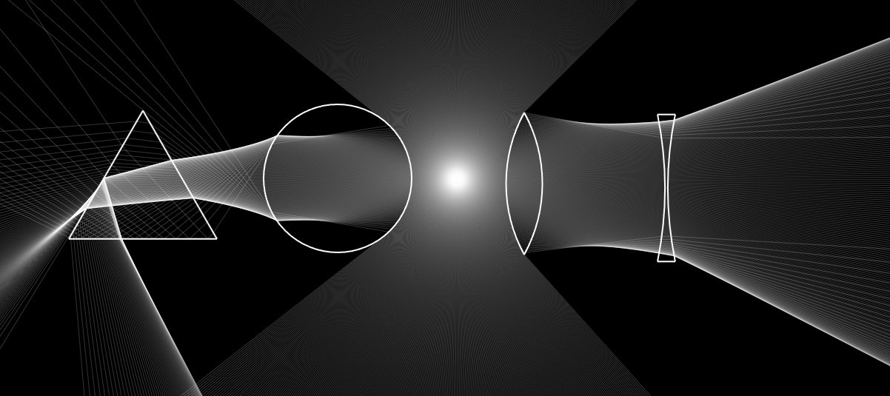
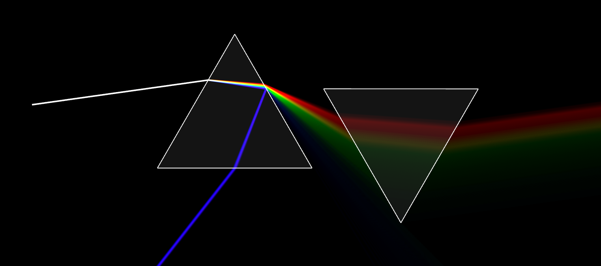
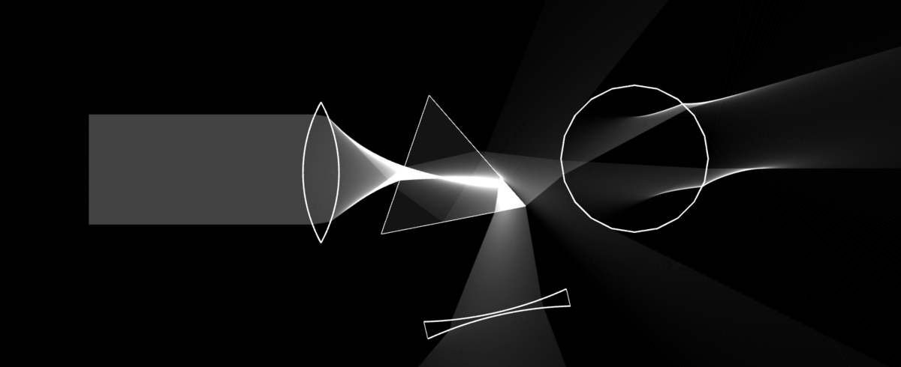
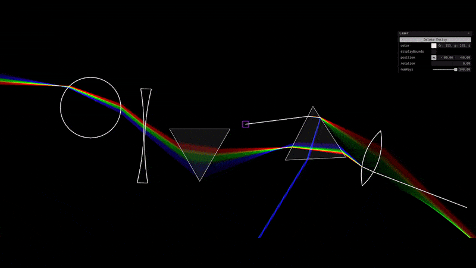
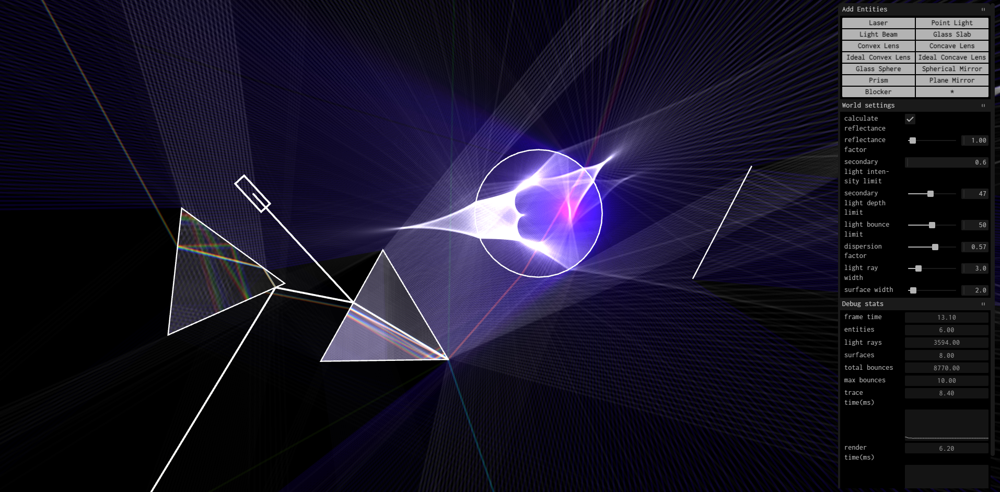
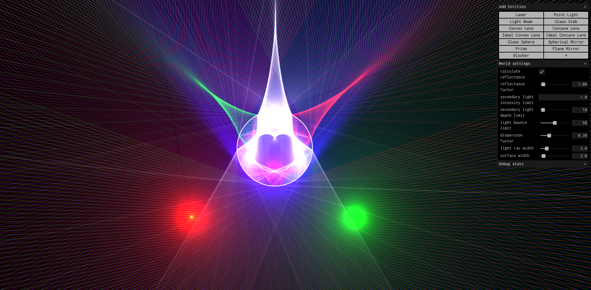
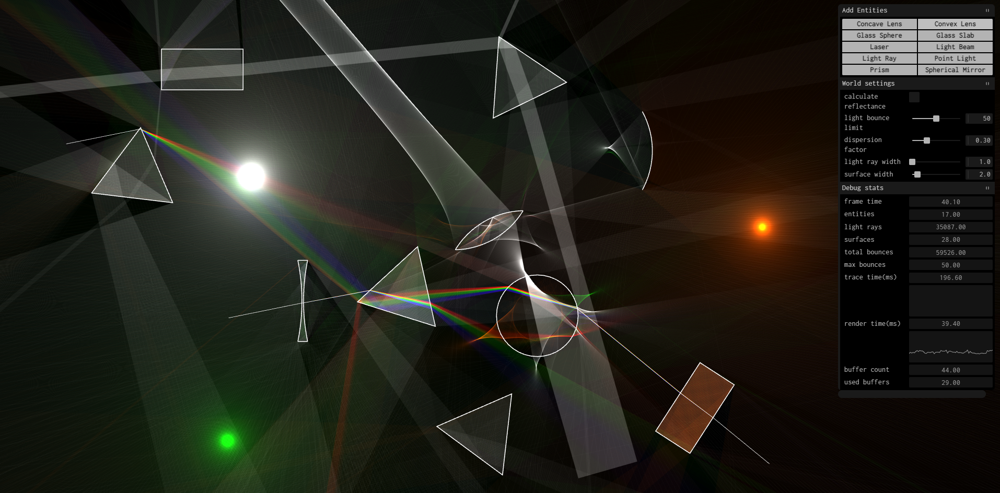

# Reflecta - An Optics Playground

### [Check it out here!](https://kinetictactic.github.io/reflecta)

Reflecta is a simple and robust sandbox-type program written in JavaScript to simulate light rays reflecting and refracting (in 2D). You can play around with various types of light sources (Point lights, Light Beams) and various objects (Refractive/Reflective surfaces, Lenses, Prisms, Mirrors, etc.).

## Features

-   Light Sources such as Point Lights, Light Rays, Light Beams and Lasers, and objects such as Prisms, Lenses (ideal and realistic), Mirrors, etc.

-   Reflection, Refraction, and Total internal reflection based on Snell's laws.

-   Realistic partial reflection/refraction (reflectance/transmittance) calculation using fresnel equations. Enable it in `World settings > calculate reflectance`.

-   Dispersion of rays, variable refractive indices based on wavelength

-   Accurate Color simulation from wavelength using CIE1964 color transforms.

-   Dynamically update properties in real time.

-   Uses [polyly](https://github.com/KineticTactic/polyly) for rendering, a fast and dynamic WebGL 2D primitives renderer that I wrote specifically for this project.

## Screenshots

<!--  -->

<!--  -->

## Running locally / Contributing

To get the project up and running locally,

Clone the git repository

`git clone https://github.com/kinetictactic/reflecta.git`

`cd reflecta`

Install dependencies with pnpm (or npm / yarn)

`pnpm install`

Start the vite development server

`pnpm run dev`

## Things to add

-   [x] UI for adding new objects and editing object parameters
-   [ ] More objects
-   [ ] Ray diagram markings? Principal axis and stuff
-   [x] Dispersion of rays
-   [x] Switch to WebGL

## Why did i make this?

Its a learning experience for me.

I was really fascinated when I got to learn about Optics in Physics in high school, and I always wanted to make a "sandbox" type of thing where I could play around with lenses and prisms and stuff. That, along with my hunt for simple creative coding projects to work on, led me to build this project.

Other than that, I also like the idea of this being used for educational purposes, like in a classroom, for demonstrating the various light phenomena and image formations, interactively.

## External Dependencies

-   [polyly](https://github.com/KineticTactic/polyly/), a WebGL 2D primitives renderer that i built specifically for this project.

-   [Tweakpane](https://tweakpane.github.io/docs/), a data-driven UI library.

-   [Tweakpane Essentials](https://github.com/tweakpane/plugin-essentials), plugin for graphs in Tweakpane.
